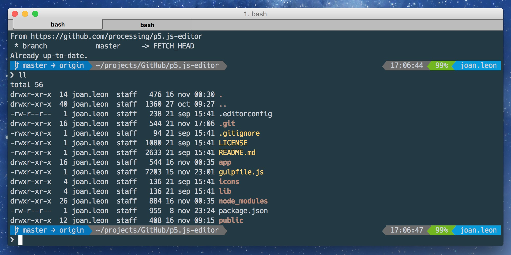

### iTerm2
**iTerm2** is a replacement for Terminal and the successor to iTerm. It works on Macs with OS 10.5 (Leopard) or newer. iTerm2 brings the terminal into the modern age with features you never knew you always wanted.

* [iTerm2](https://www.iterm2.com/)
* Theme: [Ocean Dark of base16](https://github.com/chriskempson/base16)
* Font: [Hack](https://github.com/chrissimpkins/Hack)

### Bash-it
**Bash it** is a collection of community bash commands and scripts. (And a shameless ripoff of [oh-my-zsh](https://github.com/robbyrussell/oh-my-zsh) :smiley:)

Includes autocompletion, themes, aliases, custom functions, a few stolen pieces from Steve Losh, and more.

* [Bash-it](http://github.com/Bash-it/bash-it)
* Theme: [Powerline-multiline](https://github.com/Bash-it/bash-it/tree/master/themes/powerline-multiline)
* Font: [powerline](http://github.com/powerline/fonts)
* Plugins:
  * aws
  * base
  * battery
  * browser
  * git
  * history
  * javascript
  * less-pretty-cat
  * node
  * nvm
  * osx
* Aliases:
  * atom
  * general
  * git
  * homebrew
  * npm
  * osx

### Spanish translation
You will find a tutorial about this terminal configurations on DesarrolloWeb: [Configuración de terminal con Bash-it / iTerm2](https://desarrolloweb.com/articulos/personalizacion-terminal-bash-it-iterm2.html)
